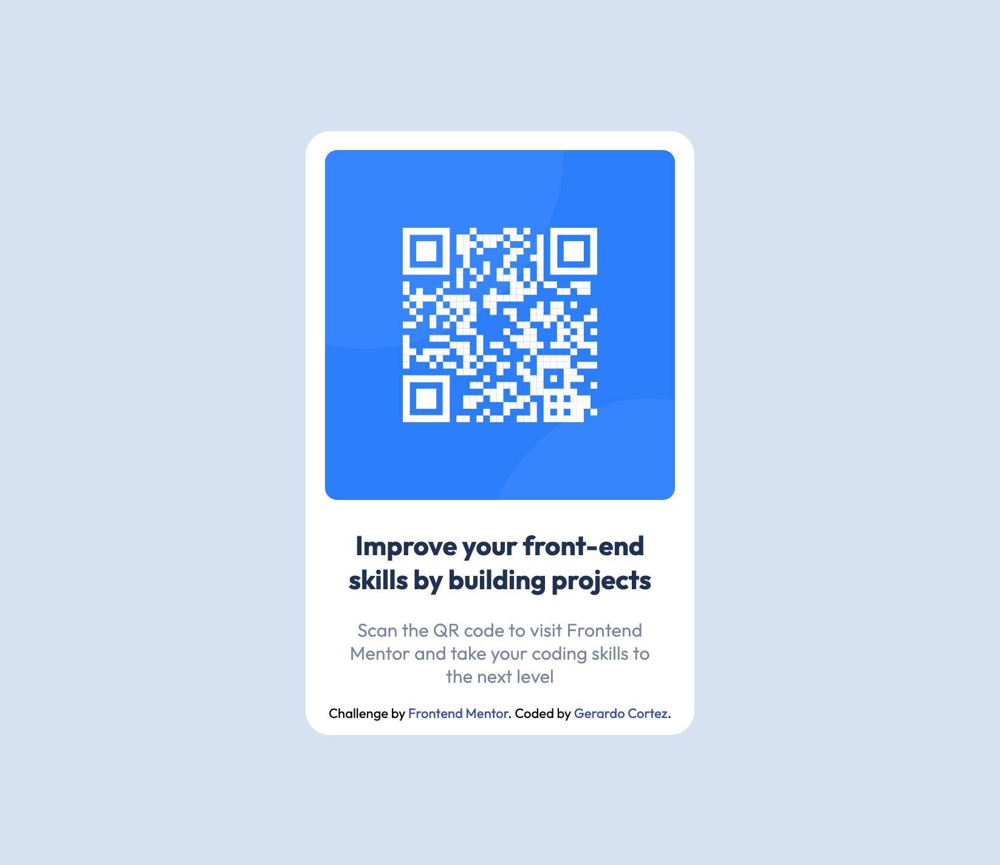

# Frontend Mentor - QR code component solution

This is a solution to the [QR code component challenge on Frontend Mentor](https://www.frontendmentor.io/challenges/qr-code-component-iux_sIO_H). Frontend Mentor challenges help you improve your coding skills by building realistic projects. 

## Table of contents

- [Overview](#overview)
  - [Screenshot](#screenshot)
  - [Links](#links)
- [My process](#my-process)
  - [Built with](#built-with)
  - [What I learned](#what-i-learned)
  - [Continued development](#continued-development)
- [Author]

## Overview

### Screenshot



Add a screenshot of your solution. The easiest way to do this is to use Firefox to view your project, right-click the page and select "Take a Screenshot". You can choose either a full-height screenshot or a cropped one based on how long the page is. If it's very long, it might be best to crop it.

Alternatively, you can use a tool like [FireShot](https://getfireshot.com/) to take the screenshot. FireShot has a free option, so you don't need to purchase it. 

Then crop/optimize/edit your image however you like, add it to your project, and update the file path in the image above.

**Note: Delete this note and the paragraphs above when you add your screenshot. If you prefer not to add a screenshot, feel free to remove this entire section.**

### Links

- Solution URL: [Add solution URL here] https://github.com/BoiWonderr/QRCodeWeb.git(https://your-solution-url.com)
- Live Site URL: [Add live site URL here](https://your-live-site-url.com)

## My process

### Built with

- Semantic HTML5 markup
- CSS custom properties
- CSS Grid
- Mobile-first workflow


### What I learned
I'm specifically proud of this CSS because I learned that margin: auto can be used to center the card I made. Centering has always been an issue for me so this was very important to learn.

```html
```
```css
main {
    background-color: var(--clr-white);
    height: 33.133rem;
    width: 21.333rem;
    border-radius: 20px;
    box-shadow: 0 10px 10px 0 var(--clr-gray);
    margin: auto;
    display: grid;
    grid-template-areas: 
    "qr"
    "title"
    "caption"
    "annotation";
    grid-template-rows: 65% 13% 17% 5%;
}
```
```js
```

### Continued development

I want to improve on Grids even though I've gotten better at it, I believe I still need some work so I can master it. I'll continue to work on Grids and then move on to Flexbox!

## Author

- Website - [Gerardo Cortez](https://www.your-site.com)
- Frontend Mentor - [@BoiWonderr](https://www.frontendmentor.io/profile/BoiWonderr)
- Twitter - [@gcort_z2](https://x.com/gcort_z2)
- Instagram - [@g_cortez2](https://www.instagram.com/g_cortez2/)
